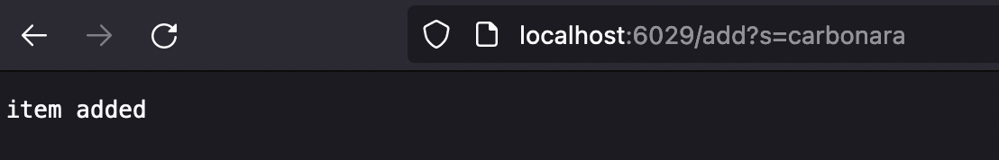
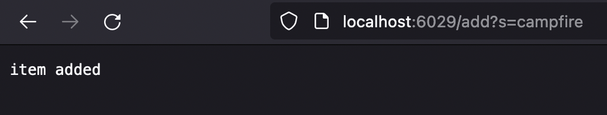
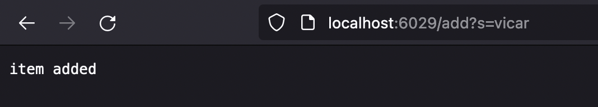
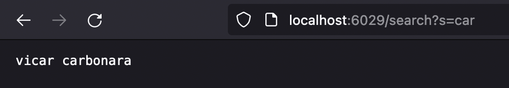

## Week 3: Lab Report 2

# Part 1

The following code block contains the code for SearchEngine.java:
```
import java.net.URI;
import java.util.ArrayList;
import java.io.IOException;

class SearchEngineTwo implements URLHandler {

    ArrayList<String> tempList = new ArrayList<String>();
    
    public String handleRequest(URI url) {
        if (url.getPath().contains("/add")) {
            String [] item = url.getQuery().split("=");
            if(item[0].equals("s")) {
                tempList.add(item[1]);
                return "item added";
            }
        }
        else if (url.getPath().contains("/search")) {
            String [] tItem = url.getQuery().split("=");
            String printfn = "";
                if(tItem[0].equals("s")) {
                    ArrayList<String> finalList = new ArrayList<String>();
                    for (int i = 0; i < tempList.size(); i++ ) {
                        if (tempList.get(i).contains(tItem[1])) {
                            finalList.add(tempList.get(i));
                        }
                    }
                    for(int j = 0; j < finalList.size(); j++) {
                        printfn = printfn + " " + finalList.get(j);
                    }
                    return printfn;
                }
        }
        return "Error";
    }
}

class SearchEngine {
    public static void main(String[] args) throws IOException {
        if(args.length == 0){
            System.out.println("Missing port number! Try any number between 1024 to 49151");
            return;
        }

        int port = Integer.parseInt(args[0]);

        Server.start(port, new SearchEngineTwo());
    }
}
```

The following are screenshots of the `add` function being used on the server to add the specified word in the query to a list -> <br> <br>

<br><br>
In this case, the argument provided in the parameter to the method is the following URL = localhost:6029/add?s=carbonara. Since the portion of the query after the "=" is the string "carbonara", the value of item[1] will be set to "carbonara". item[1] is then added to the empty ArrayList that represents the overall list of added items
<br><br>

<br><br>
In this case, the argument provided in the parameter to the method is the following URL = localhost:6029/add?s=campfire. Similar to the first case, item[1] is set to campfire and is added to the ArrayList.
<br><br>

<br><br>
In this case, the argument provided in the parameter to the method is the following URL = localhost:6029/add?s=vicar. Similar to the first case, item[1] is set to vicar and is added to the ArrayList.
<br><br>
The following screenshot shows the result of the `search` function which is used to return the strings in the ArrayList that contain the string in the query.
<br><br>

<br><br>
Since the words "vicar" and "carbonara" contain the string "car" specified in the query of the URL, they are returned by our search function. "campfire" is not returned despited being in the master ArrayList since it does not contain the sequence "car". "car" becomes the value of tItem[1]. The `contains()` method is iterated over all of the strings in the ArrayList using a for loop. All of the words containing the specified string are then added to another new ArrayList, and the results are returned from said ArrayList, displaying the words that contained the specified string.

--- 

# Part 2
<br>

## 1. `reversed` from `ArrayExamples`
The following test provides input that results in an error:

```
@Test
  public void testReversedMult() {
    int[] input1 = {2,3,5,7,9};
    assertArrayEquals(new int[]{9,7,5,3,2}, ArrayExamples.reversed(input1));
  }
```

<br><br>

The code results in the method returning an array of only elements 0. If the code was tested with a 4 element array input, it would return the array {0,0,0,0}. The following code block shows the error output from a test: <br><br>
```
4) testReversedMult(ArrayTests)
arrays first differed at element [0]; expected:<9> but was:<0>
        at org.junit.internal.ComparisonCriteria.arrayEquals(ComparisonCriteria.java:78)
        at org.junit.internal.ComparisonCriteria.arrayEquals(ComparisonCriteria.java:28)
        at org.junit.Assert.internalArrayEquals(Assert.java:534)
        at org.junit.Assert.assertArrayEquals(Assert.java:418)
        at org.junit.Assert.assertArrayEquals(Assert.java:429)
        at ArrayTests.testReversedMult(ArrayTests.java:42)
        ... 30 trimmed
Caused by: java.lang.AssertionError: expected:<9> but was:<0>
        at org.junit.Assert.fail(Assert.java:89)
        at org.junit.Assert.failNotEquals(Assert.java:835)
        at org.junit.Assert.assertEquals(Assert.java:120)
        at org.junit.Assert.assertEquals(Assert.java:146)
        at org.junit.internal.ExactComparisonCriteria.assertElementsEqual(ExactComparisonCriteria.java:8)
        at org.junit.internal.ComparisonCriteria.arrayEquals(ComparisonCriteria.java:76)
        ... 36 more
```
The incorrect impelmentation for the `reversed` function is shown in the code block below:

```
 static int[] reversed(int[] arr) {
    int[] newArray = new int[arr.length];
    for(int i = 0; i < arr.length; i += 1) {
      arr[i] = newArray[arr.length - i - 1];
    }
    return arr;
  }
```

The bugs are on lines 4 and 5. The code returns an error since the incorrect implementation assignes the values of the input array to an empty array and returns the input array. The correct implementation of the code is given below:

```
 static int[] reversed(int[] arr) {
    int[] newArray = new int[arr.length];
    for(int i = 0; i < arr.length; i += 1) {
    newArray[arr.length - i - 1] = arr[i];
    }
    return newArray;
  }
```
<br><br>

## 2. `merge` method in `ListExamples`
<br>

The following is the code required to test if two lists can be merged using the implementation of the `merge` method provided. 
```
import static org.junit.Assert.*;
import org.junit.*;
import java.util.ArrayList;
import java.util.List;

public class ListTests{

    @Test
    public void mergeTest() {
        List<String> input1 = new ArrayList<String>();
        input1.add("a");
        input1.add("b");
        List<String> input2 = new ArrayList<String>();
        input2.add("c");
        input2.add("d");
        List<String> expected = new ArrayList<String>();
        expected.add("a");
        expected.add("b");
        expected.add("c");
        expected.add("d");
        assertEquals(expected, ListExamples.merge(input1,input2));
    }
}
```
This test results in a failed test with the following output: 

```
1) mergeTest(ListTests)
java.lang.OutOfMemoryError: Java heap space
        at java.base/java.util.Arrays.copyOf(Arrays.java:3512)
        at java.base/java.util.Arrays.copyOf(Arrays.java:3481)
        at java.base/java.util.ArrayList.grow(ArrayList.java:237)
        at java.base/java.util.ArrayList.grow(ArrayList.java:244)
        at java.base/java.util.ArrayList.add(ArrayList.java:454)
        at java.base/java.util.ArrayList.add(ArrayList.java:467)
        at ListExamples.merge(ListExamples.java:42)
        at ListTests.mergeTest(ListTests.java:21)
        at java.base/java.lang.invoke.LambdaForm$DMH/0x0000000801012400.invokeVirtual(LambdaForm$DMH)
        at java.base/java.lang.invoke.LambdaForm$MH/0x0000000801013000.invoke(LambdaForm$MH)
        at java.base/java.lang.invoke.Invokers$Holder.invokeExact_MT(Invokers$Holder)
```

We get a `Java heap space` error, which suggests that there is not enough space for the data we need to be stored. <br>
Below is the incorrect implementation of the method:

```
  static List<String> merge(List<String> list1, List<String> list2) {
    List<String> result = new ArrayList<>();
    int index1 = 0, index2 = 0;
    while(index1 < list1.size() && index2 < list2.size()) {
      if(list1.get(index1).compareTo(list2.get(index2)) < 0) {
        result.add(list1.get(index1));
        index1 += 1;
      }
      else {
        result.add(list2.get(index2));
        index2 += 1;
      }
    }
    while(index1 < list1.size()) {
      result.add(list1.get(index1));
      index1 += 1;
    }
    while(index2 < list2.size()) {
      result.add(list2.get(index2));
      index1 += 1;
    }
    return result;
  }
```

In the implementation, after the method is done adding an element form list2, it increments index1. This results in index2 never increasing, which means the while loop on starting on line 20 never ends. This could cause our `Java heap error`. The actual bug is on line 20, where `index +=1`. 
<br>

The correct implementation of line 20 is:
```
    index2 += 1;
```


