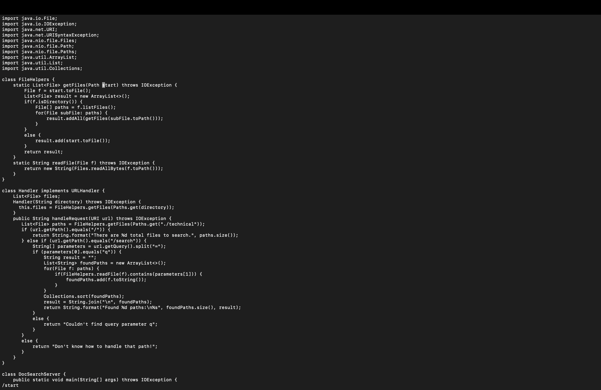
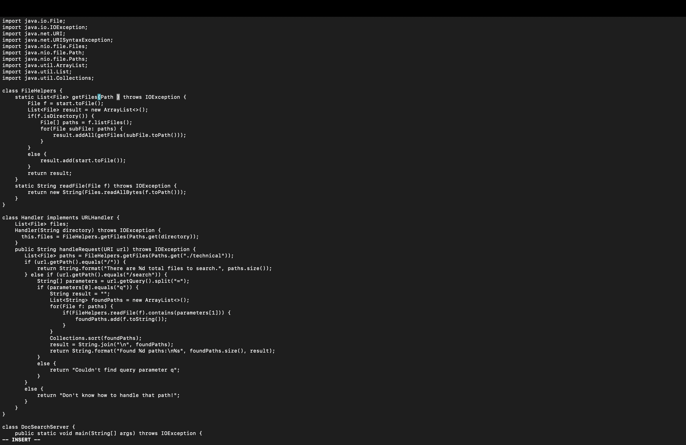
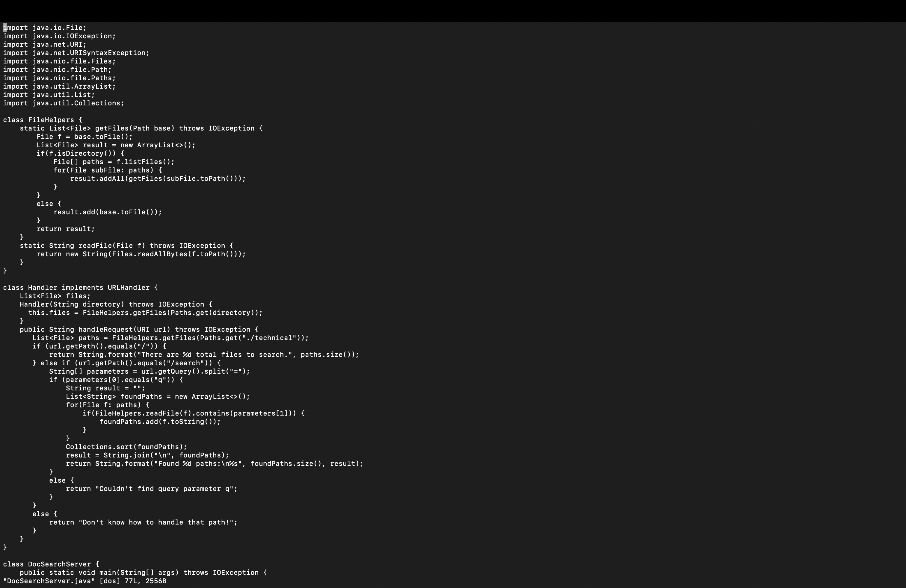

# Week 7 Lab Report - Vim

The shortest sequence of keystrokes that my group was able to come up with in order to change the name of the `start` parameter in `getFiles` an all of its uses to `bas` was the following:    
`/start<Enter>cebase<Esc>n.n.:wq<Enter>`    

The following is an image of the terminal running Vim after the `vim DocSearchServer.java` has been run, without any changes having yet been performed. Notice that the cursor is located at the top left of the screen:  

  

1. `/start<Enter>` :

When the key strokes above are entered, the cursor moves to the first appearance of the sequence of characters `start`. `<Enter>` executes the search while `/` indicates a search is being performed. Below is a screenshot of this behavior:   
  

Notice that the cursor is now at the first appearance of the sequence of characters `start` in the file.

2. `ce` :

When the cursor is on the first letter of a word, the keystrokes `ce` deletes the word and switches vim into input mode. The following is a screenshot of this behavior   
 

Notice that the word `start` has been deleted and at the bottom left of the screen we can see that vim has been switched to `input` mode.

3. `base<esc>`:

The above keystrokes type out the word `base` in the location from where `start` was deleted. The `<esc>` key returns the editor to `normal` mode. The following is a screenshot of this behavior  

 

Notice how base is now a parameter for the function and the editor is no longer in insert mode, as evidenced by the lack of `--insert--` at the bottom left. 

4. `n.n.` :

In the above keystrokes, `n` sends the cursor to the next instance of the sequence of characters `start`. `.` will then replicate the change we made previously (sections 3 and 4) at that location, i.e, `start` will be changed to base at the two other locations where `start` appears in the function, since `n.` is typed twice. The following is a screenshot of this behavior:   

As we can see, the other two instances of `start` in the method have been changed to `base`.

5.`:wq<Enter>`

The keystrokes `:wq<Enter>` will save the changes we have made to the file and exit back to the terminal. If reopen the file with vim once again, we see the following:   

As we can see, the changes we have made, replacing `start` with `base` in the `getFiles()` method have been saved.

## Part 2:

Making the changes to the file and using `scp` to copy it to the remote desktop takes `53 seconds` while making changes using vim directly on the remote computer takes `31 seconds`. Make changes directly is quicker since it does not involve having to copy over changes made locally. There were no difficulties in performing either task.

> Q1. Which of these two styles would you prefer using if you had to work on a program that you were running remotely, and why?

If I had to work on a program that I was running remotely and I had the ability to ssh into the computer first, I would prefer this method. This is because the file is being edited locally on the remote computer and there will be no possible copying errors or blunders by the user, even if rare, when using `scp` to copy the edited file to the remote server. 

> Q2. What about the project or task might factor into your decision one way or another? (If nothing would affect your decision, say so and why!)

My choice would definitely depend on the complexity of the task that I am trying to perform. If I was working on a project and had to write large chunks of my own code, I would prefer to use a high utility text editor such as VS Code or an IDE on my local computer for comfort. However, If I only need to to edit a few lines of code in the file on a remote computer, make changes on the remote computer using vim is much quicker and is less work overall.