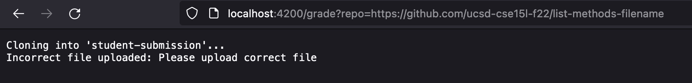

# Lab Report 5 - Grade Script

The following code block contains the bash script file to determine the grade for various implementations of the `ListExamples.java file`: <br>

```
# Create your grading script here

CPATH=".:lib/hamcrest-core-1.3.jar:lib/junit-4.13.2.jar"
#set -e 

rm -rf student-submission
git clone $1 student-submission

cd student-submission
if [[ -f "ListExamples.java" ]]
    then 
        echo "Correct file uploaded"
    else 
        echo "Incorrect file uploaded: Please upload correct file"
        exit 1
fi 

cp ListExamples.java ..
cd ..
javac -cp $CPATH *.java

if [[ $? -eq 0 ]]
    then
        echo "Compilation success"
    else
        echo "File does not compile. Please ensure submission compiles to recieve any grade"
        exit 1
fi

java -cp $CPATH org.junit.runner.JUnitCore TestListExamples > file.txt

if [[ $? -eq 0 ]]
    then 
        echo "All tests passed. Grade: Pass"
        exit
    else
        echo "All tests not passed. Please fix methods to recieve a pass grade."
        echo "See error messages here: "
        cat file.txt
        exit
fi
```

The following lines of code are run to start a local server to check the code recieved from the github repo. <br>

```
javac Server.java GradeServer.java
java GradeServer 4200
```
<br>

The URL required to view the server on the browser and ensure the grading script runs on the server is the following: `http://localhost:4200/grade?repo=https://github.com/<github link>`

1. **Example 1:** https://github.com/ucsd-cse15l-f22/list-methods-corrected

When the URL is `http://localhost:4200/grade?repo=https://github.com/ucsd-cse15l-f22/list-methods-corrected`, we get the following output:
<br><br>

<br><br>

2. **Example 2:** https://github.com/ucsd-cse15l-f22/list-methods-compile-error

When the URL is `http://localhost:4200/grade?repo=https://github.com/ucsd-cse15l-f22/list-methods-compile-error`, we get the following output:
<br><br>

<br><br>

3. **Example 3:** https://github.com/ucsd-cse15l-f22/list-methods-filename

When the URL is `http://localhost:4200/grade?repo=https://github.com/ucsd-cse15l-f22/list-methods-filename`, we get the following output:
<br><br>

<br><br>

## Trace for Example 3:

`CPATH=".:lib/hamcrest-core-1.3.jar:lib/junit-4.13.2.jar"` assigns the location of the junit tester to a variable. Its standard output is the assignment and the exit code is 0. 

`rm -rf student-submission` ensures that the student-submission directory is empty. Its standard output will be deleting all the files in the directory. Its exit code will be 0. 

`git clone $1 student-submission` clones the `ListExamples.java` file from the github repository into the student-submission folder. Its exit code will be 0.

The statement `if [[ -f "ListExamples.java" ]]` is false in the case of this example since the file in the github repositry is named incorrectly, leading the code to proceed to `echo "Incorrect file uploaded: Please upload correct file"`. 

The script then exits with the code 1 (non-zero) due to the line `exit 1`. Since the script has been exited here, none of the subsequent lines of code are run and the output displayed above is shown. Only the highlighted lines mentioned in the trace are run by the script in Example 3. All other lines are not run.  


