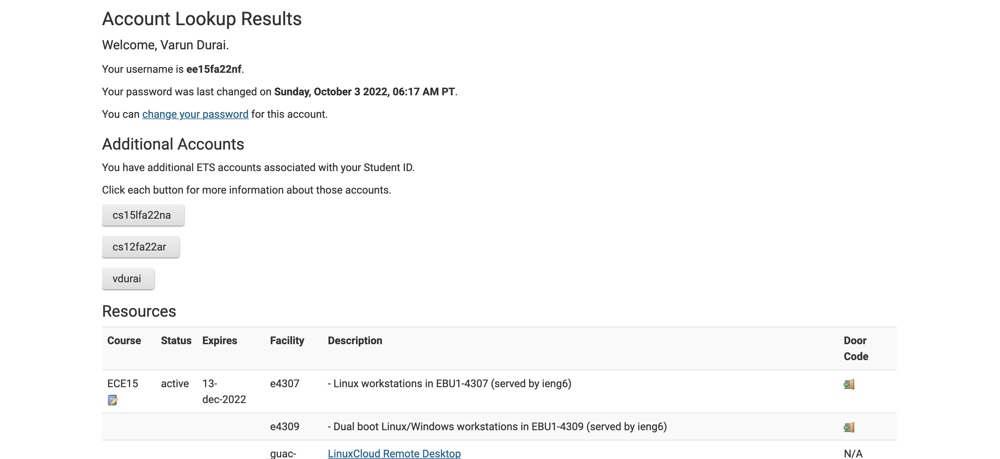
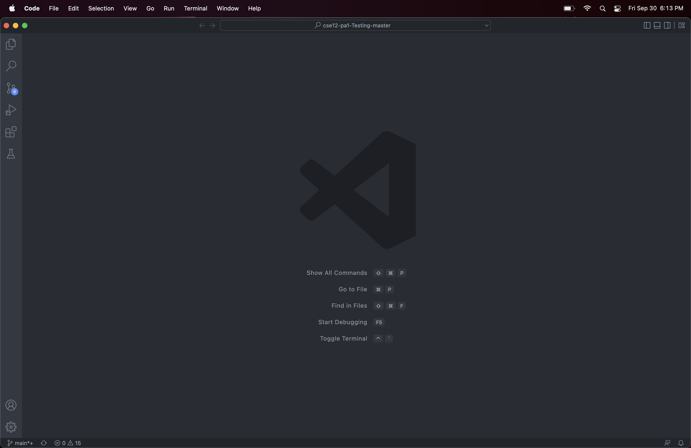
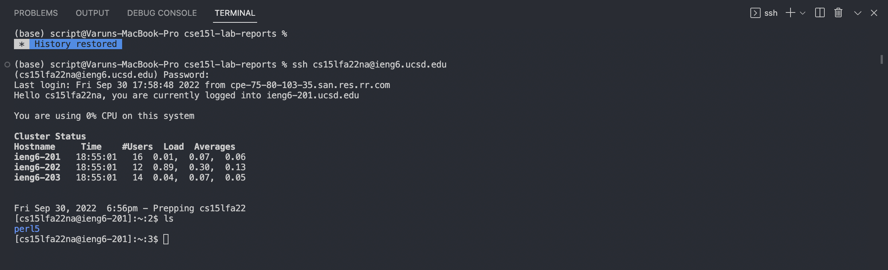
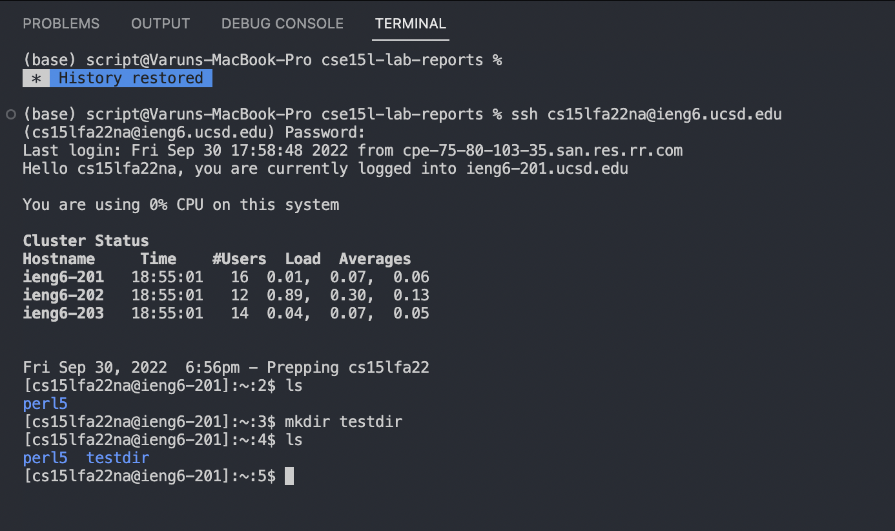
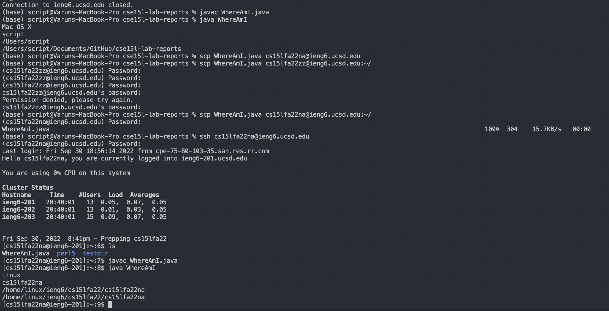
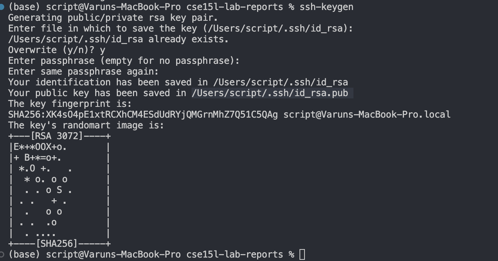
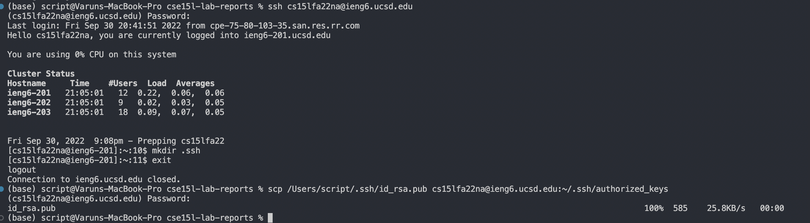
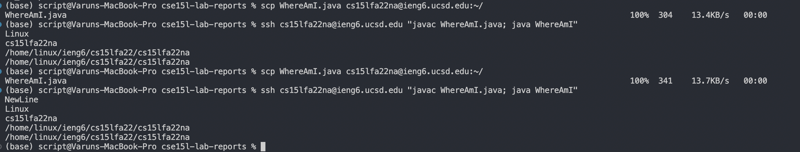
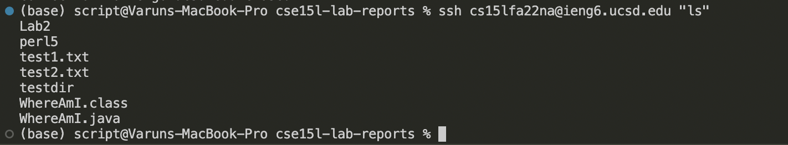

# Week 1 Lab Report
## Remote Access Tutorial - CSE 15L

**Step 1**: Change your account specific password. This is accomplished by visiting [this](https://sdacs.ucsd.edu/~icc/index.php) website, navigating to your course specific account and clicking change password.This will allow you to access the remote directory. Below is an image of the page leading to the password change page:<br><br>


**Step 2**: Install Visual Studio Code. Often called VS Code, Visual Studio Code is a text editor that can be used to create and edit different types of files. <br>
<br> 
VS Code can be installed using the following link: [Visual Studio Code](https://code.visualstudio.com/download) <br>
<br>
The terminal is also easily accesible from VS Code, making it conveniant for our intended purposes. <br>
<br>
Once downloaded and opened, VS Code should show a screen similar to the one below: <br>
<br>
 <br>
<br>
**Step 3**: Open the terminal through `Terminal > New Terminal` in VS Code and run the ssh command using the name of your specific account. In my case, the command will be: 
```
ssh cs15lfa22na@ieng6.ucsd.edu
```
**Note**: You will have to install the [OpenSSH client](https://learn.microsoft.com/en-us/windows-server/administration/openssh/openssh_install_firstuse?tabs=gui) if you are on Windows. MacOSX and Linux users do not need to do this. <br>
<br>
The terminal will prompt you to enter a password. Something important to note here is that **the terminal will not display the characters of your password**. <br>
Once the password is successfully entered, you terminal should look something like this:

If you see something similar to the above, you have succeeded in connecting to a remote computer!<br>
<br>
**Step 4**: **Trying a command**<br>
We can now try running a couple of commands in the remote directory. <br>
<br>
The `mkdir` command will allow us to create a folder in the remote directory with a specified name. <br>
The `ls` command will list all the files/folders present in the directory where the command is run. <br>
Below is an image of the terminal with an example of both commands being used:

<br>
We can now exit the remote computer using the `exit` command.<br> <br>
**Step 5**: **Copying files to the remote server using the `scp` command** <br>
We can now create a file on our local computer called `WhereAmI.java`. <br>
```
class WhereAmI {
    public static void main(String[] args) {
      System.out.println("NewLine");
      System.out.println(System.getProperty("os.name"));
      System.out.println(System.getProperty("user.name"));
      System.out.println(System.getProperty("user.home"));
      System.out.println(System.getProperty("user.dir"));
    }
  }
```


Once you have copied the specified code into the file, **remember to save** and compile and run the file using the following commands:
```
javac WhereAmI.java
java WhereAmI
```
From the directory where the file is located, run the following command:
```
scp WhereAmI.java cs15lfa22zz@ieng6.ucsd.edu:~/
```
where `zz` is replace with the letters in your user specific account name. *You will see in the image below that I made the mistake of trying my password without the `zz` being replaced.
<br>
Once the file has been successfully copied to the remote computer, run the compile and run commands in the remote computer to observe the differences in output with the local computer. <br>
Below is a picture of the process described above: 
<br><br>
**Step 6**: **Generating SSH keys**<br>
Generating SSH keys will allow us to access the remote computer without going through the tedious login process. 
Run the `ssh-keygen` command on your local terminal.
Press `enter` for every prompt and take note of the location of your public key. In my case, my public key is located in `/Users/script/.ssh/id_rsa`.

<br>

Next, login to the remote computer make a directory named `.ssh`. Then, exit the remote computer and use `scp` to copy the public key to the new directory in the remote computer. <br>
<br><br>
**Step 7**: **Optimizing Remote Running** <br>

We can then use the following commands to copy and run and edited version of the WhereAmI file to the remote computer:<br><br>
 <br>

The above picture involves running an `scp` command to copy the file to the remote computer followed by a `ssh` command followed by a special syntax to access and run the file in question. Surrounding the command in quotes after an `ssh` command will run it on the remote server and seperating commands with semicolons will allow multiple commands to be run from a single line. <br>
This gives us a much simpler method of copying and accessing files and running commands in between the remote and local computer without having to constantly enter a password. <br><br>
<br>

The above image shows the `ls` command being run from the local computer but being executed in the remote computer, similar to the `javac` and `java` commands from the previous image.   


